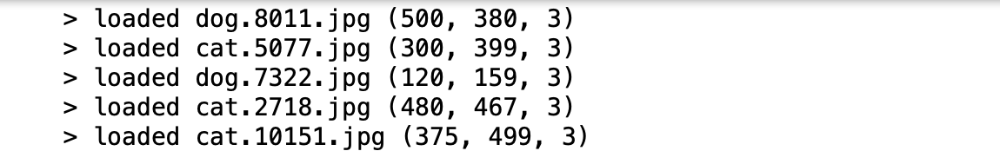

## Convolutional Neural Network

Deep learning is a subfield of machine learning that studies the design of algorithms which can learn. 
Different deep learning models excel in different areas, including image classification, recommendations systems, image, audio and text generation and etc.
In this notebook we will demonstrate convolutional neural network, which will be used to perform an image classification task.
Convolutional Neural Network is a specific kind of deep neural network, which is commonly referred to as CNN or ConvNet.
CNN is a deep, feed-forward artificial neural network, because information flows right through the model and there are no feedback connections from the outputs of the model back into itself.


### 1. Collecting and Preparing the Data
 
The dataset that will be trained here is a collection of pictures of dogs and cats downloaded from [image-net](http://www.image-net.org). And we will train an image classifier to tell us whether an image contains a dog or a cat, using TensorFlow’s eager API.
 
The first step is to read the image file in python as array data (for instance `image.imread('dogs-vs-cats/test1/1.jpg')`), and we could see that different images have different shapes:

```python
  for filename in listdir('dogs-vs-cats/train'):
      img_data = image.imread('dogs-vs-cats/train/' + filename)
      loaded_images.append(img_data)
      print('> loaded %s %s' % (filename, img_data.shape))
```   




In order to use the keras module in python to analyse the images data, the second step we need to do is to reshape 
all images so that they have the same size.


Store the array data for the images and label it as `X`, and let `0` represents dog and let `1` represents cat and then we store this as `Y`.
We could check our data by reading the array data and displaying it as image:


Now split the data into traning data and testing data. 

```python
train_X = X[:20000]
train_Y = Y[:20000]
test_X  = X[20000:25000]
test_Y  = Y[20000:25000]
```

Note that now each data in `X` has shape (125, 94, 3) which could be understood by the Machine Learning algorithm, but it is in an int8 format, and before feeding it into the network we need to convert its type to float32. We also rescale the pixel values in range 0 - 1 at the same time by dividing the pixels by 255 (the maximal pixel value in int8 format):

```python
train_X = train_X.astype('float32')
test_X  = test_X.astype('float32')

train_X = train_X / 255.
test_X  = test_X / 255.
```


ML algorithm could not understand categorical data `Y`, so we need to convert each element in `Y` to one-hot encoding vector `Y_one_hot` where `0` will be transformed to `[1, 0]` and `0` will be transformed to `[0, 1]`:

```python
from keras.utils import np_utils

train_Y_one_hot = np_utils.to_categorical(train_Y)
test_Y_one_hot  = np_utils.to_categorical(test_Y)
```


The last step in pre-processing the data is dividing the training data into 2 parts: training and validation parts. This is important becasuse this will also help reduce overfitting problem. Here we will train the model on 80% of the training data and validate it on 20\% of the remaining training data:

```python
from sklearn.model_selection import train_test_split

train_X, valid_X, train_label, valid_label = train_test_split(train_X, 
                                                              train_Y_one_hot, 
                                                              test_size = 0.2, 
                                                              random_state = 13)
```


### 2. Construct Network Layers

Now that our data are in correct shape,
the images are of size 125 x 94 x 3, rescaled between 0 and 1, so we feed this as an input to the network.

We'll use three convolutional layers:

* 1. The first layer will have 32 3 x 3 filters,
* 2. The second layer will have 64 3 x 3 filters and
* 3. The third layer will have 128 3 x 3 filters.

After each convolutional layer, a *Leaky ReLU* (Rectified Linear Unit) activation function will be applied, and there will also be a max-pooling layer each of size 2 x 2. These will help the network to learn complex patterns (non-linear decision boundaries) in the data. Also, subsampling techniques reduce feature dimensions, which helps in reducing overfitting.

The 2 x 2 max-pooling layer works in the following way:


Note that an activation function is basically just a simple function that transforms its inputs into outputs that have a certain range. If the activation function is not applied, the output is nothing but a simple linear transformation of the input.
For instance, the sigmoid activation function (logistic function)


takes input and maps the resulting values in between 0 to 1.

Here the Leaky ReLu activation function that is based on ReLU function is introduced to our structure, which takes the following form:
`f(x)=max(0.01*x , x)`.


In addition, after each max-pooling layer, a dropout rate is applied, which helps in reducing overfitting problem furthermore. 


Now that we have the complete feature learning step for our network model. The next step is to feed the flattened feature to the network for classification. In order to do this, we construct some fully connected layers for the flattened feature. 
The objective of these layers is to flatten the high-level features that are learned by convolutional layers and combining all the features together. It passes the flattened output to the output layer where you use a some classifiers (e.g. softmax classifier or a sigmoid) to predict the input class label.


The full architecture of our model is described by the following code:

```python
animal_model = Sequential()
animal_model.add(Conv2D(32, kernel_size=(3, 3), 
                         activation='linear', padding='same', 
                         input_shape=(125, 94, 3)))
animal_model.add(LeakyReLU(alpha=0.1))
animal_model.add(MaxPooling2D((2, 2), padding='same'))
animal_model.add(Dropout(0.25))
animal_model.add(Conv2D(64, (3, 3), activation='linear',padding='same'))
animal_model.add(LeakyReLU(alpha=0.1))
animal_model.add(MaxPooling2D(pool_size=(2, 2),padding='same'))
animal_model.add(Dropout(0.25)) 
animal_model.add(Conv2D(128, (3, 3), activation='linear',padding='same'))
animal_model.add(LeakyReLU(alpha=0.1))                  
animal_model.add(MaxPooling2D(pool_size=(2, 2),padding='same'))
animal_model.add(Dropout(0.4))  
animal_model.add(Flatten())
animal_model.add(Dense(128, activation='linear'))
animal_model.add(LeakyReLU(alpha=0.1))           
animal_model.add(Dropout(0.3))  
animal_model.add(Dense(num_classes, activation = 'softmax'))
```


### 3. Compile and Train the Model

After the model is created, we first compile it and then train the model with batch size = 80 and the number of epoch = 12.

```python
animal_model.compile(loss = keras.losses.categorical_crossentropy, 
                      optimizer = keras.optimizers.Adam(),
                      metrics=['accuracy'])
                      
animal_train = animal_model.fit(train_X, 
                                train_label, 
                                batch_size = batch_size,
                                epochs = epochs,
                                verbose = 1,
                                validation_data = (valid_X, valid_label))             
```

For the last 3 epochs,


we can see that the there is still some overfitting issue with our model, since the validation loss 0.4013 is much large compared with the training loss 0.1700. 


### 4. Evaluate and Predict the Model

```python
test_eval = animal_model.evaluate(test_X, 
                                   test_Y_one_hot, 
                                   verbose=1)   
```


We could also plot the training and validation accuracy and loss plots:


and we see that the validation loss and accuracy does not change much after the 4th epoch.


For prediction, we run the following code:

```python
animal_model.predict(test_X)
```


