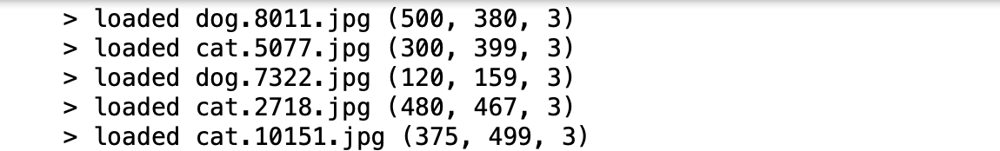

## Convolutional Neural Network

Deep learning is a subfield of machine learning that studies the design of algorithms which can learn. 
Different deep learning models excel in different areas, including image classification, recommendations systems, image, audio and text generation and etc.
In this notebook we will demonstrate convolutional neural network, which will be used to perform an image classification task.
Convolutional Neural Network is a specific kind of deep neural network, which is commonly referred to as CNN or ConvNet.
CNN is a deep, feed-forward artificial neural network, because information flows right through the model and there are no feedback connections from the outputs of the model back into itself.


### Collecting Data
 
The dataset that will be trained here is a collection of pictures of dogs and cats downloaded from [image-net](http://www.image-net.org). And we will train an image classifier to tell us whether an image contains a dog or a cat, using TensorFlow’s eager API.
 
The first step is to read the image file in python as array data (for instance `image.imread('dogs-vs-cats/test1/1.jpg')`), and we could see that different images have different shapes:

```python
  for filename in listdir('dogs-vs-cats/train'):
      img_data = image.imread('dogs-vs-cats/train/' + filename)
      loaded_images.append(img_data)
      print('> loaded %s %s' % (filename, img_data.shape))
```   




In order to use the keras module in python to analyse the images data, the second step we need to do is to reshape all images so that they have the same size:


